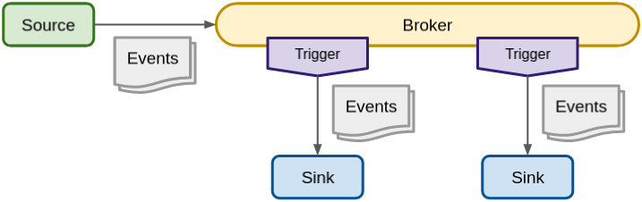

[//]: # (Copyright, Michael Vittrup Larsen)
[//]: # (Origin: https://github.com/MichaelVL/knative-katas)
[//]: # (Tags: #knative-eventing #brokers #triggers)

# Brokers and Triggers

This exercise demonstrates Knative eventing brokers and triggers. These are the
basic components used to build a message bus for event distribution and define
filtering on which events applications should receive.



A basic Knative `Broker` (basically a message bus) can be defined with the
following resource manifest:

```yaml
apiVersion: eventing.knative.dev/v1
kind: Broker
metadata:
  name: broker-a

```

Create the broker:

```console
kubectl apply -f deploy/broker.yaml
```

Next we create a source which forwards events to the broker, i.e. the sink of
this source is the broker:

```yaml
apiVersion: sources.knative.dev/v1
kind: ContainerSource
metadata:
  name: event-emitter
spec:
  template:
    spec:
      containers:
      - image: ghcr.io/michaelvl/knative-katas@sha256:4b3d49ac8ffe76db79415162fcf074b6ed9d8bebb0d2d168df2bddc458dbd56f
        workingDir: /apps/event-emitter
        env:
         - name: APP_DATA
           value : '{"msg": "Hello from container source through broker!"}'
         - name: APP_CRON_SCHEDULE
           value : '*/5 * * * * *'
  sink:
    ref:
      apiVersion: eventing.knative.dev/v1
      kind: Broker
      name: broker-a

```

Create the source:

```console
kubectl apply -f deploy/container-source-broker.yaml
```

Next we create a service which are intended to receive events:

```console
kubectl apply -f deploy/simple-service-no-response.yaml
```

The source will emit an event every 5 seconds, however (try using `kubectl logs
-f` on the `event-emitter-deployment-xxx` POD), if we observe logs from the
`simple` service, we do not yet see any events:

```console
stern "simple-.*" -c user-container
```

Whats missing is a filter that attaches to the broker and forwards events to
`simple` service. A `Trigger` defines a broker, a filter and a Sink:

```yaml
apiVersion: eventing.knative.dev/v1
kind: Trigger
metadata:
  name: trigger1
spec:
  broker: broker-a
  filter:
    attributes:
      type: type-example
  subscriber:
    ref:
      apiVersion: serving.knative.dev/v1
      kind: Service
      name: simple

```

Deploy the trigger:

```console
kubectl apply -f deploy/trigger.yaml
```

After this we observe the events in the `stern` log output.

Next, try changing the value of `spec.filter.attributes.type` in the event
filter using:

```console
KUBE_EDITOR=nano kubectl edit trigger trigger1
```

If you change it to anything else than its current value, the `simple` service
stops receiving events.

Knative filters are **exact match only**. If multiple attributes are defined in
the filter, these conditions are **AND'ed**, i.e. they must all match for an
event to be forwarded. Logical OR of filter values require multiple trigger
definitions.

## One to Many Distribution

The broker will forward events to any service that have a filter for the given event.

Restore the trigger/filter for the first `simple` service:

```console
kubectl apply -f deploy/trigger.yaml
```

Create an additional service:

```console
kubectl apply -f deploy/simple2-service-response-type2.yaml
```

and monitor its logs:

```console
stern "simple2-.*" -c user-container
```

and create a filter

```console
kubectl apply -f deploy/trigger2.yaml
```

You will now see the same event being delivered to both services.

As an interesting setup, try editing `trigger2` and change the sink from service
`simple2` to `simple`, i.e. create two triggers both having the `simple` service
as the sink:

```console
KUBE_EDITOR=nano kubectl edit trigger trigger2
```

This has the effect of sending the same event twice to the `simple` service and
this is a consequence of the `filter` resource resulting in two Knative eventing
channel subscriptions.

### Responding with Event

Our source generate event of type `type-example` and both our trigger filters
are configured for this event type. However, the service `simple2` responds to
events with a new event in the response to the HTTP POST message. This event is
of type `type-example2`. If we update our filter for the `simple` service we can
build the following chain of event processing with the broker being our central
message bus:

```
Source ---> broker ---> simple2-service ---> broker ---> simple-service
```

Restore `trigger2` to remove any edits done above:

```console
kubectl apply -f deploy/trigger2.yaml
```

and edit the filter in the trigger for `simple` - change
`spec.filter.attributes.type` value from `type-example` to `type-example2`:

```console
KUBE_EDITOR=nano kubectl edit trigger trigger1
```

The fact, that the `simple` service now receives an event from `simple2` can be
seen from the event type logged by `simple` and also from the slight delay
between the `stern` log output from `simple2` to `simple` (service `simple2` is
configured with 1 second simulated processing delay).

## Cleanup

```console
kubectl delete -f deploy/trigger.yaml
kubectl delete -f deploy/trigger2.yaml
kubectl delete -f deploy/simple-service-no-response.yaml
kubectl delete -f deploy/simple-service2.yaml
kubectl delete -f deploy/container-source-broker.yaml
kubectl delete -f deploy/broker.yaml
```
